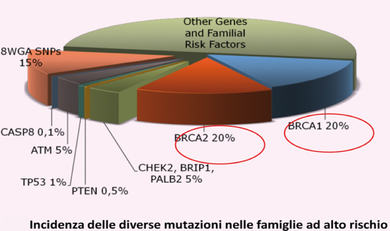

# Introduzione
## Oggetto dello studio: Il tumore al seno

Il tumore mammario (più comunemente chiamato tumore al seno) è una patologia che ha ad oggetto una lesione oncologica nel tessuto mammario. Rappresenta il principale tipo di neoplasia nelle donne ed il 25% di tutti i casi oncologici documentati.
La conferma diagnostica avviene  tramite biopsia e, una volta fatta, si effettuano nuovi test per determinare se e quanto il tumore si è espanso e quale trattamento preferire. Sono stati classificati più di 18 sottotipi di tumore alla mammella, e la prognosi varia a seconda del tipo, del diametro del tumore e dell’età del paziente. I tassi di sopravvivenza hanno valori stimati tra l’80% ed il 90% a 5 anni dalla diagnosi.

## Obiettivo dello studio 
L’obiettivo dello studio è la valutazione della performance predittiva di un modello di rischio (Cox) addestrato tramite combinazione di covariate cliniche e geniche, con particolare attenzione sull'impatto di quest'ultime sulla probabilità di sopravvivenza dei pazienti. 

```{r pressure, echo=FALSE, fig.cap="Statistiche ponderate per l’ età dei decessi dovuti al cancro al seno per 100.000 abitanti nel 2004", out.width = '100%'}
knitr::include_graphics("_images/image1.png")
```

\newpage

## Dati forniti e contesto clinico
I dati di analisi riguardano uno studio osservazionale condotto su 144 pazienti con età compresa tra i 26 ed i 53 anni a cui è stato diagnosticato un tumore mammario con coinvolgimento linfonodale.
Il grado del tumore può assumere 3 stati a seconda di quanto l’aspetto delle cellule tumorali si differenziano dal tessuto mammario normale. Dalla letteratura sappiamo che più il tessuto tumorale è scarsamente differenziato dal tessuto normale e più ha una prognosi peggiore.
\newline
Le cellule tumorali mammarie possono inoltre presentare un recettore per l’ormone dell’estrogeno (ER = 1) oppure non presentarlo (ER=0); ciò è importante in fase prognostica e terapeutica in quanto la dimensione del tumore cresce grazie all’estrogeno, e fornire farmaci che inibiscono tale recettore può bloccare la crescita del tumore.
\newline
I dati sono chiaramente orientati ad uno studio sull’insorgenza precoce del tumore al seno, in quanto ben l’80% delle diagnosi globali viene fatta ad un’ età superiore ai 50 anni, il 15% ad un’età compresa tra i 40 ed i 50, e solo il 5% per età inferiori ai 40.
Infine, è presente un pool di 70 geni potenzialmente prognostici, la cui è espressione genica è selezionata valutata tramite test del DNA a microarray. L’importanza del fattore genetico nell’incidenza del tumore mammario è già documentata con una certa significatività in circa il 5% dei casi: ad esempio, i portatori dei geni BRCA1 e BRCA2 (non presenti nel nostro dataset) hanno una probabilità di contrarre il tumore dal 60% al 80%.



