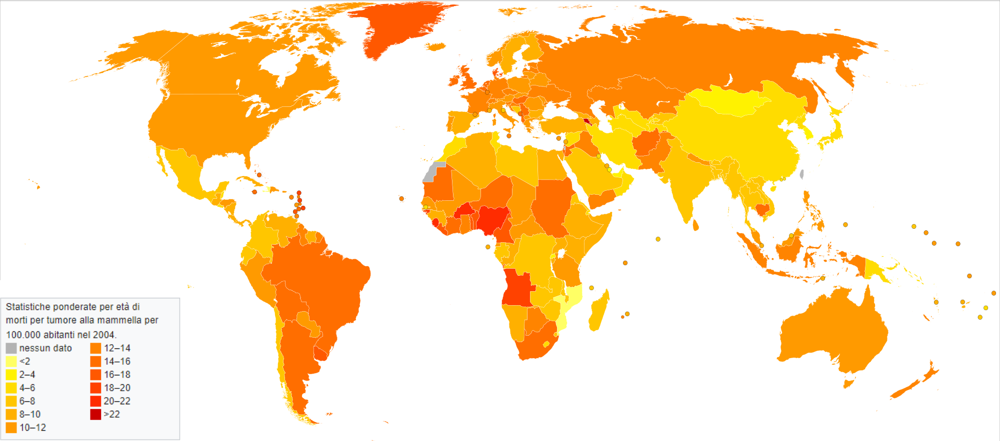
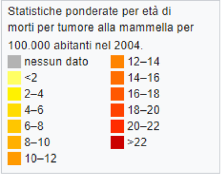

# Capitolo 1
## Breve introduzione discorsiva allo studio
Da consegnare:

1. Codice R

2. Report dei risultati:
  
• Breve introduzione discorsiva allo studio (contesto clinico e obiettivo dell’analisi)
  
• Statistiche descrittive su tutte le variabili del campione in studio

• Analisi univariate dell’associazione di ciascun fattore con l’outcome in studio

• Analisi principale dello studio:

- sviluppo del modello di rischio con covariate cliniche al basale (valutare forma funzionale delle variabili continue e assunzione «Proportional Hazards»)

- valutazione della performance del modello (calibrazione, discriminazione, Net Benefit) per la predizione del rischio di evento ad un time-point fisso (es. progetto 1: 5 anni; progetto 2: 12 mesi).

- sviluppo del modello di rischio che contiene anche il marker misurato longitudinalmente (progetto 1) o il set selezionato di variabili di espressione genica (progetto 2)

- Predizione del rischio di evento per 3 soggetti «tipo» (scelti casualmente nel dataset o nuovi ipotetici soggetti) basata sul nuovo modello

- Breve commento discorsivo ai risultati. Menzionare eventuali limiti dei dati e problematiche riscontrate durante analisi.

Scopo del progetto:
Valutazione della performance predittiva di un modello di rischio con covariate cliniche e sviluppo di un modello analogo che include tra i predittori anche un set di variabili di espressione genica selezionate tramite regressione penalizzata. 

DATASET: breast cancer

Nr. osservazioni: 144

Variabili:

- time: tempo di follow-up libero da metastasi (in mesi).

- event: indicatore di evento (1 = metastasi o morte; 0 = censura).

- Diam: Diametro del tumore (2 livelli).

- N: numero di linfonodi coinvolti (2 livelli).

- ER: status del recettore di estrogeni (2 livelli). 

- Grade: grado del tumore (tre livelli ordinati).

- Age: età della paziente alla diagnosi (in anni).

- TSPYL5 ... C20orf46: misura di espressione genica di 70 geni potenzialmente prognostici

## Oggetto dello studio: Il tumore al seno

Il tumore mammario (più comunemente chiamato tumore al seno) è una patologia che ha ad oggetto una lesione oncologica nel tessuto mammario. Rappresenta il principale tipo di neoplasia nelle donne ed il 25% di tutti i casi oncologici documentati.
La conferma diagnostica avviene  tramite biopsia e, una volta fatta, si effettuano nuovi test per determinare se e quanto il tumore si è espanso e quale trattamento preferire. Sono stati classificati più di 18 sottotipi di tumore alla mammella, e la prognosi varia a seconda del tipo, del diametro del tumore e dell’età del paziente. I tassi di sopravvivenza hanno valori stimati tra l’80% ed il 90% a 5 anni dalla diagnosi.

## Obiettivo dello studio 
L’ obiettivo dello studio è la valutazione della performance predittiva di un modello di rischio con covariate cliniche e sviluppo di un modello analogo che include tra i predittori anche un set di variabili di espressione genica selezionate tramite regressione penalizzata.

## Dati forniti e contesto clinico
I dati di analisi riguardano uno studio osservazionale condotto su 144 pazienti con età compresa tra i 26 ed i 53 anni  a cui è stato diagnosticato un tumore mammario con coinvolgimento linfonodale, che può essere minore o maggiore di una soglia fissata a 4 linfonodi.
Il grado del tumore può assumere 3 stati a seconda di quanto l’aspetto delle cellule tumorali si differenziano dal tessuto mammario normale. Dalla letteratura sì sa che più il tessuto tumorale scarsamente differenziato dal tessuto normale, più il tumore ha una prognosi peggiore.

Le cellule tumorali mammarie possono inoltre presentare un recettore per l’ormone dell’estrogeno (ER=1) oppure non presentarlo (ER=0); ciò è importante in fase prognostica e terapeutica in quanto la dimensione del tumore cresce grazie all’estrogeno, e fornire farmaci che inibiscono tale recettore può bloccare la crescita del tumore.
I dati sono chiaramente orientati ad uno studio sull’insorgenza precoce del tumore al seno, in quanto ben l’80% delle diagnosi globali viene fatta ad un’ età superiore ai 50 anni, il 15% ad un’età compresa tra i 40 ed i 50, e solo il 5% per età inferiori ai 40.
Infine, è presente un pool di 70 geni potenzialmente prognostici, la cui è espressione genica è selezionata valutata tramite test del DNA a microarray. L’importanza del fattore genetico nell’incidenza del tumore mammario è già documentata con una certa significatività in circa il 5% dei casi: ad esempio, i portatori dei geni BRCA1 e BRCA2 (non presenti nel nostro dataset) hanno una probabilità di contrarre il tumore dal 60% al 80%.

